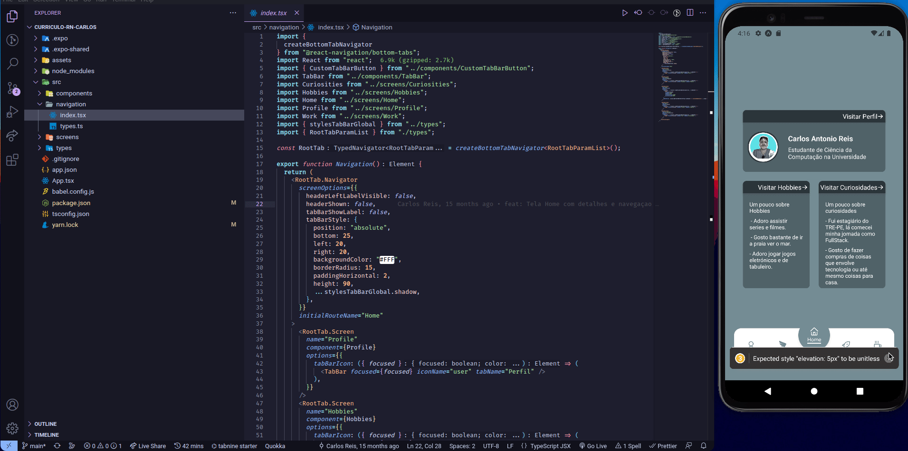

# Projeto de Criação de Curriculo no React Native

Introdução ao mundo react native criando telas para ilustrar meu currículo com navegação entre outros.

## Instalação

Instale o projeto com npm ou yarn 

```bash
  npm install ou yarn install
  cd curriculo-rn-carlos
  yarn start
```


    
## Demonstração

<div align="center">

</div>  
